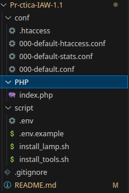

# Práctica-IAW-1.1
Repositorio de la Práctica 1.1
# Práctica Aplicaciones Web - Instalación de LAMP con Herramientas Adicionales

## Estructura de la pŕactica:



## Objetivo de la Práctica

El objetivo de esta práctica es instalar una pila LAMP (Linux, Apache, MySQL, PHP), incluyendo también herramientas adicionales cómo **PHPMyAdmin**, **Adminer** y **GoAccess**, automatizando su instalación y configuración mediante scripts de bash. Se realizarán configuraciones de seguridad, como autenticación básica en ciertas rutas del servidor, y la generación de informes en tiempo real de las estadísticas de acceso al servidor web.

## Proceso de Instalación

A continuación, se detalla el proceso de instalación y configuración que se lleva a cabo en esta práctica, explicando la función de cada archivo involucrado en el repositorio.

- **`install_lamp.sh`**: Este script automatiza la instalación de Apache, PHP y MySQL, y configura Apache para que utilice el archivo PHP `index.php`.

- **`install_tools.sh`**: Este script instala y configura las herramientas adicionales necesarias. Utiliza variables definidas en el archivo `.env` para gestionar configuraciones, como contraseñas y nombres de usuarios.

### 1. Instalación de pila LAMP:

1. **Actualización de repositorios:** Actualizamos la lista de paquetes y actualizamos los paquetes instalados a sus últimas versiones disponibles.
    ```
    apt update
    apt upgrade -y
    ```
    
2. **Instalación de Servidor Web Apache y activación del módulo rewrite:** Instalamos el servidor web apache2 y activamos el módulo rewrite de modo que permita reescribir las URLs y configurar reglas de redireccionamiento, para hacer las URLS más amigables y mejorar el SEO de los sitios web.
    ```
    apt install apache2 -y
    a2enmod rewrite
    ```

3. **Instalación de PHP y reinicio de servicio apache:** Instalamos PHP para que el servidor web Apache pueda procesar código PHP.
    ```
    apt install php libapache2-mod-php php-mysql -y
    systemctl restart apache2
    ```

5. **Copia el archivo de configuración en la ruta de sitios disponibles de apache:** Procedemos a copiar el archivo 000-default.conf, este archivo define los ajustes del Virtual Host por defecto del servidor web Apache. 
    ```
    cp ../conf/000-default.conf /etc/apache2/sites-available
    ```

6. **Instalación de MySQL Server:** Instalamos el sistema gestor de base de datos MySQL, siendo un conocido sistema de gestión de bases de datos relacional.
    ```
    apt install mysql-server -y
    ```

7. **Copia del archivo de prueba PHP en /var/www/html:** Copiamos el archivo índice de PHP y lo pegamos en /var/www/html ya que es el directorio el cuál se almacenan los archivos web que serán servidos a los usuarios.
    ```
    cp ../PHP/index.php /var/www/html
    ```

8. **Modificación del propietario:**  Hacemos un cambio de propietario y el grupo del directorio /var/www/html/adminer, también todos sus contenidos (archivos y subdirectorios) al usuario y grupo www-data, que es el usuario bajo el cual corre Apache. LLegando a la conclusión que tenga los permisos adecuados para gestionar los archivos de Adminer.
    ```
    chown -R www-data:www-data /var/www/html/adminer
    ```

### 2. Configuración de Lampp y Herramientas Adicionales

Después de tener instalada la pila LAMP, el siguiente paso es instalar herramientas adicionales como **PHPMyAdmin** y **Adminer** para gestionar bases de datos, y **GoAccess** para generar informes de estadísticas en tiempo real.

1. **Importación del archivo de variables:** Importamos el archivo dónde se almacenan las variables de modo que estén enlazadas con este archivo para su posterior uso.
    ```
    source .env
    ```

2. **Mostrar los comandos que se van ejecutando:** Luego, imprimimos por pantalla con "echo"
    ```
    set -ex 
    echo "Instalación de diversas herramientas"
    ```

3. **Actualización de respositorios**
    ```
    apt update
    apt upgrade -y
    ``` 

5. **Respuestas Automáticas para la instalación de PHPMyAdmin**
    Selección del servidor web que queremos configurar para ejecutar.
    ```
    echo "phpmyadmin phpmyadmin/reconfigure-webserver multiselect apache2" | debconf-set-selections
    ```
    Confirmamos que se desea utilizar dbconfig-common para configurar la base de datos.
    ```
    echo "phpmyadmin phpmyadmin/dbconfig-install boolean true" | debconf-set-selections
    ```
    Seleccionamos la contraseña para phpMyAdmin y la confirmación.
    ```
    echo "phpmyadmin phpmyadmin/mysql/app-pass password $PHPMYADMIN_APP_PASSWORD" | debconf-set-selection   
    echo "phpmyadmin phpmyadmin/app-password-confirm password $PHPMYADMIN_APP_PASSWORD" | debconf-set-selections
    ```

7. **Instalación de PHPMyAdmin con sus paquetes:**
    ```
    sudo apt install phpmyadmin php-mbstring php-zip php-gd php-json php-curl -y
    ```

8. **Instalación de Adminer:**
    ```
    Paso 1 - Creamos la carpeta para Adminer
    mkdir -p /var/www/html/adminer
    
    Paso 2 - Instalamos Adminer
    wget https://github.com/vrana/adminer/releases/download/v4.8.1/adminer-4.8.1-mysql.php -P /var/www/html/adminer
    
    Paso 3 - Cambiamos el nombre del sitio
    mv /var/www/html/adminer/adminer-4.8.1-mysql.php /var/www/html/adminer/index.php
    
    Paso 4 - Modificamos el propietario
    chown -R www-data:www-data /var/www/html/adminer
    ```

3. **Creación de una Base de Datos y Usuario MySQL, y también le proporcionamos privilegios:**
    ```
    mysql -u root <<< "DROP DATABASE IF EXISTS $DB_NAME"
    mysql -u root <<< "create database $DB_NAME"
    
    mysql -u root <<< "DROP USER IF EXISTS '$DB_USER'@'%'"
    mysql -u root <<< "CREATE USER '$DB_USER'@'%' IDENTIFIED BY '$DB_PASSWORD'"
    mysql -u root <<< "GRANT ALL PRIVILEGES ON $DB_NAME.* TO '$DB_USER'@'%'"
    ```

4. **Instalación de GoAccess:**
    ```
    apt install goaccess -y
    ```

5. **Creamos un directorio para los informes estadísticos:**
    ```
    mkdir -p /var/www/html/stats
    ```

6. **Creación de un archivo HTML en tiempo real en segundo plano:**
    ```
    goaccess /var/log/apache2/access.log -o /var/www/html/stats/index.html --log-format=COMBINED --real-time-html --daemonize
    ```

7. **Control de acceso a un directorio con autenticación básica:**
    ```
    cp ../conf/000-default-stats.conf /etc/apache2/sites-available
    ```

8. **Deshabilitar el virtualhost que viene por defecto:**
    ```
    a2dissite 000-default.conf
    ```

10. **Habilitar el nuevo virtualhost:**
    ```
    a2ensite 000-default-stats.conf
    ```

11. **Reinicio del servicio:**
    ```
    systemctl reload apache2
    ```

11. **Creamos el archivo de contraseñas:**
    ```
    sudo htpasswd -bc /etc/apache2/.htpasswd $STATS_USERNAME $STATS_PASSWORD
    ```

12. **Copia del archivo 000-default-htaccess.conf a la carpeta de sites-available de Apache:**
    ```
    cp ../conf/000-default-htaccess.conf /etc/apache2/sites-available
    ```

13. **Deshabilitar el antiguo virtualhost:**
    ```
    a2dissite 000-default-htaccess.conf
    ```

14. **Habilitar el nuevo virtualhost:**
    ```
    a2ensite 000-default-htaccess.conf
    ```

15. **Copia del archivo .htacess a /var/www/html/stats:**
    ```
    cp ../conf/.htaccess /var/www/html/stats
    ```

### 3. Configuración de Virtual Hosts 

El siguiente paso es configurar los **Virtual Hosts** y proteger el acceso a ciertas rutas utilizando **autenticación básica**.

- **`000-default.conf`**: Este archivo de configuración define el virtual host principal de Apache, referenciando el contenido de `/var/www/html`.

    ```
    <VirtualHost *:80>
        DocumentRoot /var/www/html
        DirectoryIndex index.php index.html
        ErrorLog ${APACHE_LOG_DIR}/error.log
        CustomLog ${APACHE_LOG_DIR}/access.log combined
    </VirtualHost>
    ```

- **`000-default-stats.conf`**: Este archivo de configuración es específico para el acceso a la carpeta de estadísticas generadas por GoAccess. Además, implementa **autenticación básica** utilizando un archivo `.htpasswd`.

    ```
    <Directory "/var/www/html/stats">
        AuthType Basic
        AuthName "Acceso restringido"
        AuthBasicProvider file
        AuthUserFile "/etc/apache2/.htpasswd"
        Require valid-user
    </Directory>
    ```

- **`.htaccess`**: El archivo `.htaccess` también establece reglas de autenticación básica para proteger directorios.

    ```
    AuthType Basic
    AuthName "Acceso restringido"
    AuthBasicProvider file
    AuthUserFile "/etc/apache2/.htpasswd"
    Require valid-user
    ```
